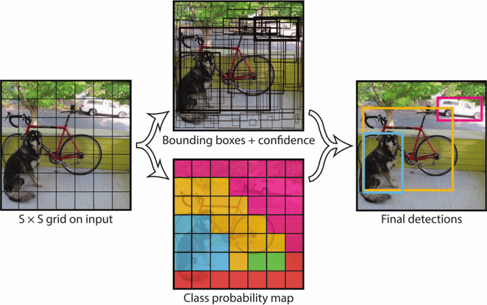
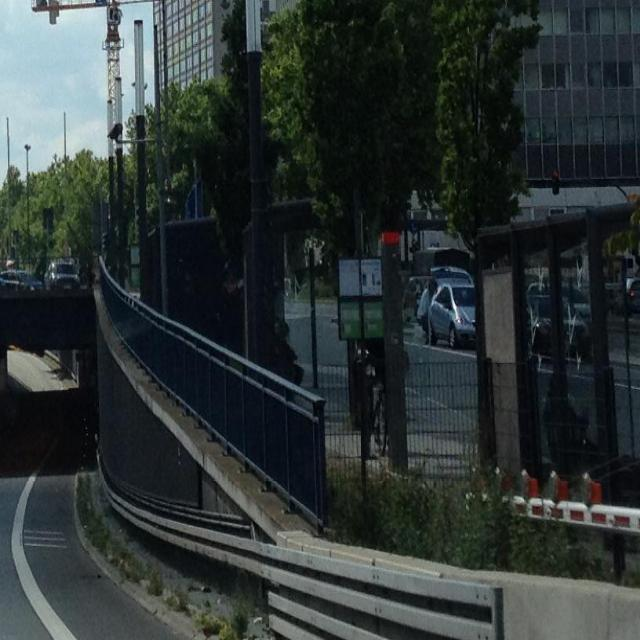
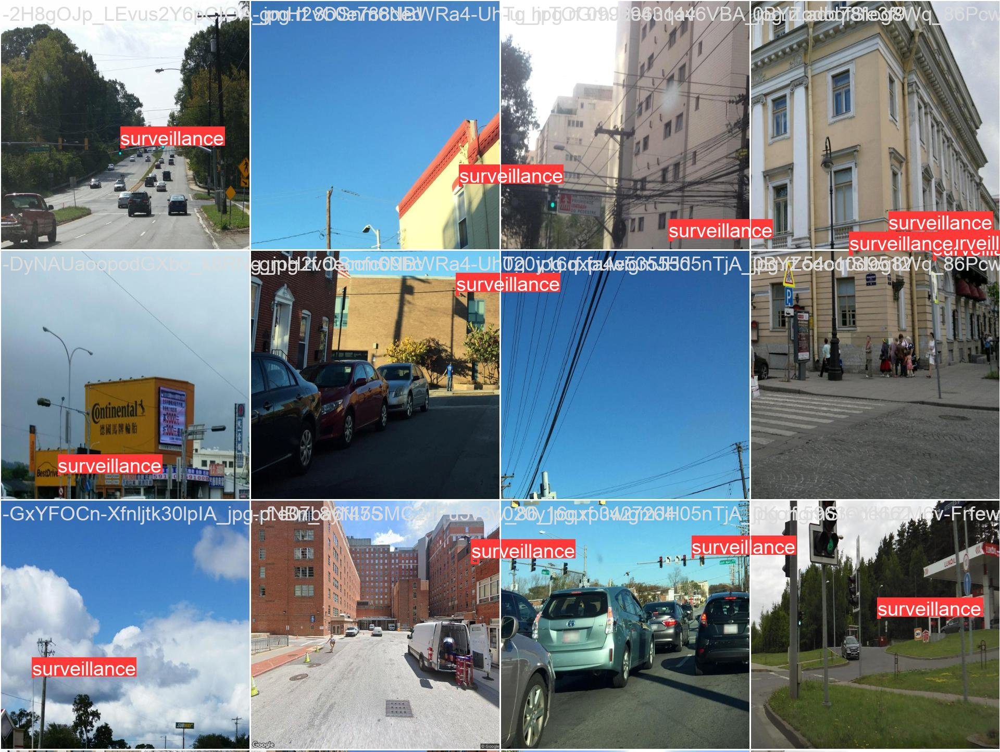
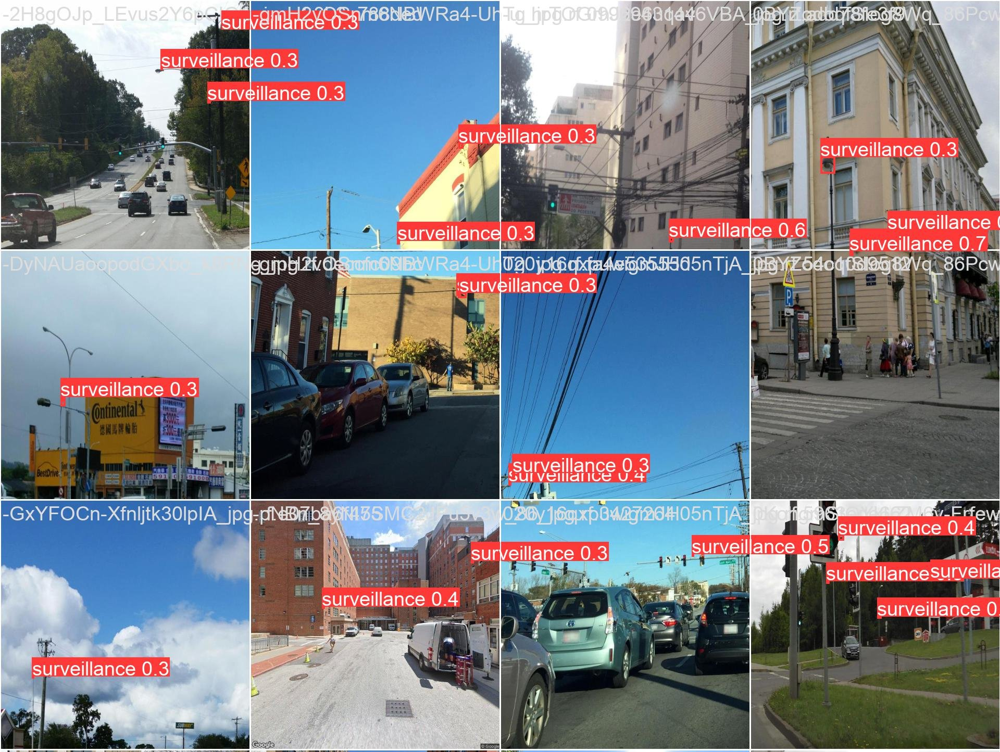
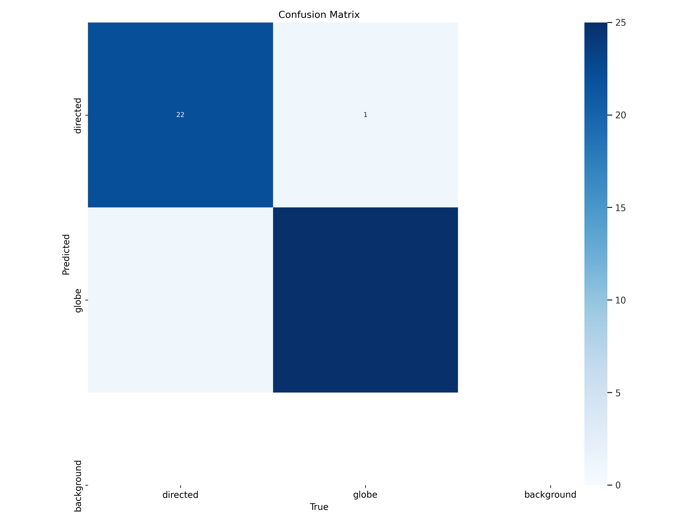
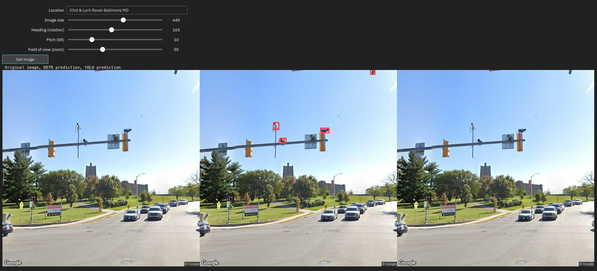

# Re-surveilling surveillance
Camille Seaberry

## Background

- Police surveillance cameras in Baltimore form one of many layers of
  state surveillance imposed upon residents.
- Little documentation, control, or oversight of surveillance landscape
- What role do tech vendors play in surveillance? How can open source
  tech be used for accountability?

### Tasks

- Identify cameras in images (object detection)
- Categorize camera types once detected (classification)

### Goals

- Improve upon / expand on models I built before—**DONE!**
- Map locations of cameras for spatial analysis—**NOT DONE**

## About the data

|                         | Google Street View          | Objects365            | Mapillary Vistas      |
|-------------------------|-----------------------------|-----------------------|-----------------------|
| Size (train, val, test) | 473 / 119 / 79              | 393 / 107 / 54        | 3,202 / 929 / 484     |
| Setting                 | Street                      | Outdoors & indoors    | Street                |
| Used for                | Detection & classification  | Detection             | Detection             |
| Release                 | Maybe a TOS violation?      | Released for research | Released for research |
| Source                  | Sheng, Yao, and Goel (2021) | Shao et al. (2019)    | Neuhold et al. (2017) |

## Tools

|                    |                                                                 |
|--------------------|-----------------------------------------------------------------|
| Ultralytics YOLOv8 | Models with built-in modules for training, tuning, & validation |
| Pytorch            | Underlies Ultralytics models                                    |
| Roboflow           | Dataset creation & management                                   |
| Weights & Biases   | Experiment tracking                                             |
| Paperspace         | Virtual machine (8 CPUs, 16GB GPU)                              |

## Models

| YOLO                                                   | RT-DETR                                                        |
|--------------------------------------------------------|----------------------------------------------------------------|
| Latest generation YOLO model                           | Transformer-based model from Baidu                             |
| Detection & classification (& others)                  | Detection only                                                 |
| Smaller architecture (medium has 26M params)           | Larger architecture (large has 33M params)                     |
| Trains very quickly & can train small models on laptop | Trains slowly & needs more GPU RAM                             |
| Doesn’t perform as well                                | Performs better                                                |
| Well-documented & integrated                           | New, not fully integrated to ecosystem (e.g. no `tune` method) |

## YOLO family

- Ultralytics released YOLOv8 this year
- Avoids anchor box calculations and comparisons of other detection
  models

YOLOv1 diagram. Redmon et al. (2016)

## Model variations

### Detection

- Freezing all but last few layers—increased speed, maybe increased
  accuracy
- Tiling images—better detection of small objects

### Classification

- No RT-DETR classifier, so just trying different sizes of YOLO

## Model variations

After lots of trial & error, best bets for detection:

- YOLO trained on full-sized images
- YOLO trained on tiled images
- RT-DETR trained on full-sized images with freezing

Example tiled image

## Results

### Training & first round of validation

YOLO works well on tiled images, but it will need to transfer to
full-sized images to be useful

## Results

### Validation examples, DETR model

Validation labels; validation predictions

<table>
<colgroup>
<col style="width: 50%" />
<col style="width: 50%" />
</colgroup>
<tbody>
<tr class="odd">
<td style="text-align: center;">

</td>
<td style="text-align: center;">

</td>
</tr>
</tbody>
</table>

## Results

### Tuning

## Results

### Tuning—what went wrong?

- Clearly needs more tuning—these metrics are *worse* than untuned
  models!
- Pick a model & tune extensively & methodically—probably YOLO tiled
  - However, that model runs the risk of not transferring well

## Results

### Classification

- Works very well
- However, this was only a very small dataset

Confusion matrix, YOLO medium

## Results

### Inference

Screenshot of an earlier demo

## Demo

Working interactive demo: <https://camilleseab-surveillance.hf.space>

## Challenges

- Many moving parts to work together
- Some components are very new & incomplete
- Hard to find lots of high-quality data
- Google Street View images aren’t permanent
- Formatting images & annotations to be compatible
- Reliable, sustained compute power
- A lot to learn!

## Potential improvements

- Need a better tuning methodology—switch to W&B
- Longer training—common benchmarks use 300 epochs
- Add slicing to inference step (SAHI, Akyon, Onur Altinuc, and Temizel
  (2022))
- Label more images for a larger dataset
  - Can use AI labelling assistants

## Next steps?

- Use the classification model to add classes back to detection images
- Infer on Mapillary images with location data for spatial analysis
  - Mapillary already has so many objects annotated, might only need to
    do this to fill in gaps

## Conclusions & implications

- This is a potentially useful start but needs more work still
- Surveillance studies, movements for police accountability seem to be
  tech-averse (with good reason), but there is a role for the
  technologies deployed against communities to be used by them as well
- Inherently reactionary to be chasing surveillance state after its
  infrastructure is built

## References

Akyon, Fatih Cagatay, Sinan Onur Altinuc, and Alptekin Temizel. 2022.
“Slicing Aided Hyper Inference and Fine-Tuning for Small Object
Detection.” In *2022 IEEE International Conference on Image Processing
(ICIP)*, 966–70. <https://doi.org/10.1109/ICIP46576.2022.9897990>.

Neuhold, Gerhard, Tobias Ollmann, Samuel Rota Bulo, and Peter
Kontschieder. 2017. “The Mapillary Vistas Dataset for Semantic
Understanding of Street Scenes.” In *Proceedings of the IEEE
International Conference on Computer Vision*, 4990–99.
<https://openaccess.thecvf.com/content_iccv_2017/html/Neuhold_The_Mapillary_Vistas_ICCV_2017_paper.html>.

Redmon, Joseph, Santosh Divvala, Ross Girshick, and Ali Farhadi. 2016.
“You Only Look Once: Unified, Real-Time Object Detection.” arXiv.
<https://doi.org/10.48550/arXiv.1506.02640>.

Shao, Shuai, Zeming Li, Tianyuan Zhang, Chao Peng, Gang Yu, Xiangyu
Zhang, Jing Li, and Jian Sun. 2019. “Objects365: A Large-Scale,
High-Quality Dataset for Object Detection.” In *2019 IEEE/CVF
International Conference on Computer Vision (ICCV)*, 8429–38.
<https://doi.org/10.1109/ICCV.2019.00852>.

Sheng, Hao, Keniel Yao, and Sharad Goel. 2021. “Surveilling
Surveillance: Estimating the Prevalence of Surveillance Cameras with
Street View Data.” In *Proceedings of the 2021 AAAI/ACM Conference on
AI, Ethics, and Society*, 221–30. AIES ’21. New York, NY, USA:
Association for Computing Machinery.
<https://doi.org/10.1145/3461702.3462525>.

Turtiainen, Hannu, Andrei Costin, Tuomo Lahtinen, Lauri Sintonen, and
Timo Hamalainen. 2021. “Towards Large-Scale, Automated, Accurate
Detection of CCTV Camera Objects Using Computer Vision. Applications and
Implications for Privacy, Safety, and Cybersecurity. (Preprint).” arXiv.
<http://arxiv.org/abs/2006.03870>.

